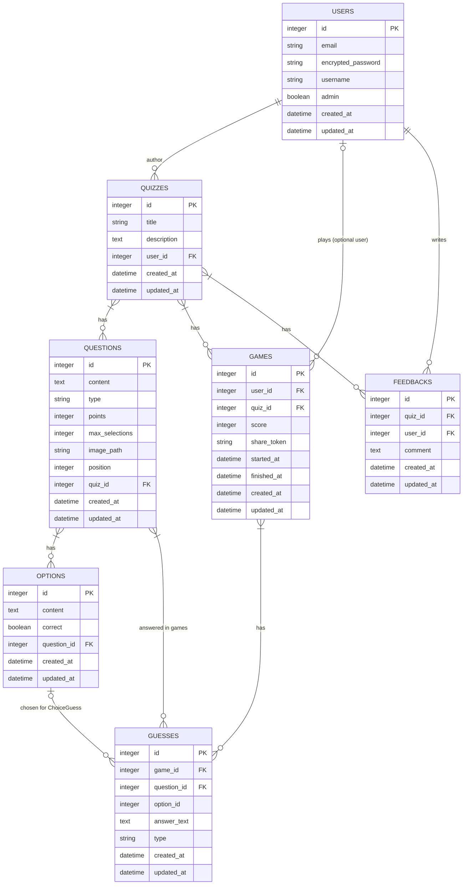

[](https://www.ruby-lang.org/)
[](https://rubyonrails.org/)
[](https://turbo.hotwired.dev/)
[](https://stimulus.hotwired.dev/)
[](https://tailwindcss.com/)
[](LICENSE)

# Henrijs Quizzes

Modern, AI-powered quiz application built with Ruby on Rails. Create, edit, and play quizzes with rich question types, images, leaderboards, and feedback features.

## Tech Stack (see [`Gemfile`](./Gemfile))

- **Hotwire** – SPA-like navigation without full page reloads.
- **Stimulus** – JavaScript framework for interactive components.
- **Tailwind** – CSS framework for rapid UI development.
- **Pundit** – Role-based authorization and policy enforcement.
- **Devise** – Secure authentication with minimal boilerplate.
- **Active Storage** – Image uploads and hosting with support for R2.

---

If the production deployment is available, you can try it here:  
[https://henrijs-quizzes-production.up.railway.app/](https://henrijs-quizzes-production.up.railway.app/)

---

## Features

- **AI Quiz Generation** — Generate quizzes from plain text descriptions using Google Gemini.
- **Multiple Question Types** — Support for single-choice, multiple-choice, and text-input questions.
- **Image Support** — Attach images to questions to make quizzes visually engaging.
- **Leaderboard** — Track top scores and average performance.
- **Responsive UI** — Powered by TailwindCSS for a modern look across devices.
- **Docker & Local Development** — Easy to run in development and production.

---

## Database logic



## Getting Started

## (A) Run with Docker (development)

```bash
docker-compose up --build
```

## (B) Run Locally (development)

Make sure you have the correct Ruby version.

### 1. Install dependencies

```bash
bundle install
```

### 2. Set up the database

```bash
bin/rails db:prepare
```

### 3. Start the application

```bash
bundle exec bin/dev
```

Look for http://localhost:3000.

---

### Environment variables for production

```
SECRET_KEY_BASE=

DATABASE_URL=

REDIS_URL=

SMTP_USERNAME=
SMTP_PASSWORD=
MAIL_FROM=

R2_ACCESS_KEY_ID=
R2_SECRET_ACCESS_KEY=
R2_ENDPOINT=
R2_BUCKET=

AWS_REQUEST_CHECKSUM_CALCULATION=WHEN_REQUIRED
AWS_RESPONSE_CHECKSUM_VALIDATION=WHEN_REQUIRED

GEMINI_API_KEY=
GEMINI_MODELS="gemini-2.5-flash, gemini-2.5-flash-lite, gemini-2.5-pro, gemini-2.0-flash, gemini-2.0-flash-lite, gemini-1.5-flash"

```

---

**Development tools:**
- **Foreman** – Process manager for running Rails, Tailwind, and jobs together.
- **Brakeman** – Static analysis for security vulnerabilities.
- **Rubocop Rails Omakase** – Code style consistency.
- **Letter Opener** – Preview emails locally in the browser.

---
Built as part of the [Mitigate Akadēmija 2025 ](https://github.com/mitigate-akademija-2025)
